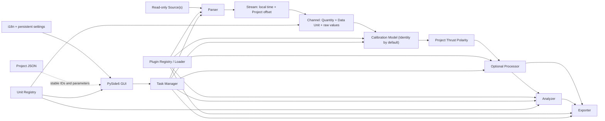
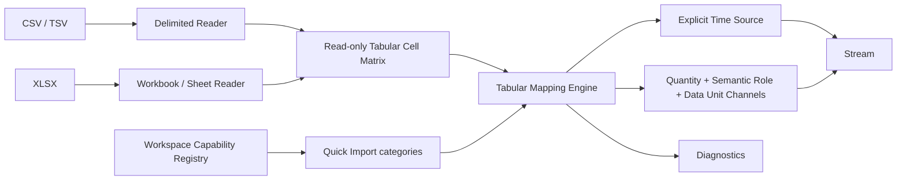

# Architecture

Underline RETLDC is an offline, layered data pipeline. Core has no GUI, TR_F, or built-in-plugin
dependency, so scientific behavior is testable without starting Qt.



## Core model

`ProjectData` owns read-only `Source` records and one or more `Stream` records. Each Stream owns a
`Dataset`, retains local timestamps, and exposes Project Time as
`t_project = t_local + time_offset_s`; different Streams need not be resampled. `Dataset` owns
arbitrary stable-ID `Channel` objects, metadata, and Diagnostics. A Channel declares Quantity,
scientific Data Unit, Unit Source, optional Display Unit override, semantic role, processing role,
immutable values, and metadata. Roles distinguish raw, calibrated, baseline, corrected, and
processed values.

Unit and Calibration are orthogonal. A known Quantity with no Parser-declared Unit receives its
canonical SI Data Unit; an explicit Parser or Project/User unit wins. Every newly parsed Channel
receives factory-default Identity Calibration regardless of Unit. Identity copies values and means
“no extra transform,” not scientific certification. Calibration can turn a sensor value such as
`count` into `N`; Unit conversion only changes representation within one physical dimension, such
as Pa→MPa or K→°C, and never mutates raw arrays. `raw`, `count`, and `ADC` are intentionally
non-convertible.

Diagnostics have `INFO`, `WARNING`, or `ERROR` severity plus a stable code, message, location,
and details. Warnings preserve usable data; errors describe conditions that prevent an operation.

`PrimaryChannelBindings` stores the Project's selected thrust, chamber-pressure, and temperature
inputs as complete `ChannelReference(source_id, stream_id, channel_id)` values. The binding is the
final workflow input. Quantity and semantic role constrain candidates and help auto-binding, but a
role never overrides an explicit binding. Calibration and processing resolve their actual output
Channels dynamically, so downstream orchestration does not assume names such as
`force_calibrated`.

## Generic tabular ingestion

Ordinary CSV, TSV, custom-delimited text, and XLSX use one explicit mapping layer:



Readers only decode external syntax into a bounded preview or sparse cell matrix. The shared
Mapping Engine applies one-based data-row bounds, an explicit time column/sample rate/sample
period, zero-based column-index mappings, missing-value policy, and header-hint diagnostics.
Header text is never the parse contract. Auto Mapping may inspect it to pre-fill an editable GUI
configuration, but `parse()` executes only the saved mapping. An absent time source blocks parsing;
there is no implicit 1 Hz fallback.

The ordinary Quick Import view obtains its categories from the Workspace Capability Registry and
currently presents `Time`, `Thrust`, `Chamber Pressure`, `Temperature`, and `Other`. It translates
those selections into the same explicit mapping consumed by the Parser. `Other` is preserved as
an auxiliary Channel but excluded from automatic binding, dedicated plots, segmentation, and
analysis. Advanced Mapping remains available in a collapsed section for direct Quantity,
Semantic Role, Channel ID, Metadata, and Ignore control.

`TabularMappingEditor` is a platform GUI capability selected through the generic
`x-underline-retldc-tabular` schema declaration and the additive `TabularParserPlugin` preview
capability. Both official Generic Delimited and Generic XLSX Parsers reuse it without a
MainWindow branch on their plugin IDs.

TR_F, TR_P, and TR_T use the shared `TwoColumnRawParserBase` Plugin API helper for bounded probing,
timestamp normalization, row diagnostics, validation, and immutable Dataset construction. Their
small concrete plugins declare only the force, chamber-pressure, or temperature semantics. Since
their syntax is intentionally identical, recommendation logic applies both an absolute threshold
and a runner-up margin and asks for confirmation when meaning is ambiguous. An explicit choice in
either the ambiguity radio group or the ordinary Parser ComboBox resolves the same stable plugin
ID and enables import. TR_P and TR_T work in a new Project without any prior TR_F import.

Reusable Tabular Presets are pure JSON and store Parser ID/version plus reader, row, time, and
column configuration. Execution remains index-based; optional expected-header hints generate a
warning when a layout may have changed. A Project embeds a private copy of the final Source mapping,
so later edits to a reusable Preset cannot change an existing Project.

## Plugin pipeline

The five Plugin API v1 contracts are Parser, Calibration Model, Processor, Analyzer, and Exporter.
Official bundled and third-party plugins use the same contracts, manifest, recursive discovery,
Registry, schema renderer, and i18n mechanism. Every concrete implementation lives below the
repository-root `plugins/` tree rather than inside the source package:

```text
Platform Core
    ↓
Plugin API v1
    ↓
plugins/
├─ parsers/
├─ calibrations/
├─ processors/
├─ analyzers/
└─ exporters/
```

The Application Plugin Root is `Application_ProjectRoot()/plugins`. It resolves to repository-root
`plugins/` during source development and the `plugins/` folder beside the executable in a frozen
folder package. The platform User Plugin Root is `%APPDATA%/Underline_RETLDC/plugins/` on Windows.
Both roots have the same layout and feed one `PluginRegistry`. Official shipped `builtin.*`
plugins in the Application Root are shown as `Bundled`; later third-party installations there are
`Application`; the fallback root is `User`. Loader provenance is informational and confers no
alternate API, permission, or trust. Folder categories are organizational; manifest `plugin_type`
is authoritative.

The interactive Installer accepts a plugin folder or one safely structured ZIP. It validates the
manifest, determines the category, performs a real write probe against the Application Root, and
attempts a staged copy there. Only an access-permission failure from the probe or actual copy moves
the new installation to the User Root. It never derives permission from a drive letter and never
requires administrator execution. Invalid metadata, API mismatch, archive corruption, and ID
conflicts remain errors. Existing IDs require explicit replacement; staging plus a directory swap
prevents old files from being mixed into the new version. Both roots remain available for manual
copy followed by Registry refresh.

Discovery recursively finds `plugin.json`, while pruning `.venv`, `.git`, `__pycache__`, and
symlink directories. `PluginLoader` validates a manifest, API compatibility, imports, descriptor
consistency, and duplicate stable IDs while converting each failure into an isolated diagnostic.
There is no hard-coded built-in registration path. The `builtin.*` ID prefix remains stable for
official shipped plugins and does not imply a `src/underline_retldc/builtin/` implementation.

## Tasks and GUI

`TaskManager` runs parsing, processing, analysis, and export callables outside the Qt main thread.
It tracks name, progress, cancellation, success/failure, result, and exception. Algorithms receive
a framework-neutral `TaskContext`, allowing a later worker-process implementation.

The GUI has five stable-ID primary workspaces. `Project` combines multi-Source selection and time
offsets, Parser probing/schema configuration, parsing/quality diagnostics, per-Channel Quantity,
Data Unit, Unit Source, Display Unit, Calibration configuration/JSON, and motor metadata. `Thrust`
combines shared test-interval candidates, numeric and draggable PRE/ACTIVE_TEST/POST
regions, processing controls, the central pyqtgraph plot, thrust metrics, and diagnostics. Its
visible curve choices are the uncorrected and corrected signals. `Chamber Pressure`, `Temperature`,
and `Data Explorer` show compatible Project Channels and the same ACTIVE_TEST marker. The GUI
invokes Core/plugins and never contains copies of formulas or unit conversions.

The Session owns the only final Project Test Segmentation. Thrust and Chamber Pressure expose two
views/editors of that state and synchronize numeric edits, candidate selection, and plot dragging
in both directions; Temperature is read-only. Both Auto Detect buttons call one controller with an
explicit role: Thrust requests only Primary Thrust and Chamber Pressure requests only Primary
Chamber Pressure. Pressure activity polarity is fixed at `+1`; thrust detection uses the Project's
independently stored polarity-normalized working signal and never reads Processor configuration.
The Core fallback selector retains pressure-then-thrust priority for non-page callers.

Thrust, Chamber Pressure, and Temperature are composed from one `AnalysisWorkspaceShell` with a
shared `AnalysisPlotWidget` and `AnalysisResultsPanel`. This keeps plot sizing, legend behavior,
PRE/ACTIVE_TEST/POST markers, Reset Chart, theme updates, empty states, and result-table stretching
consistent. Reset Chart temporarily disables display-only curve clipping before
restoring the full data-driven automatic X/Y range; it does not alter the Project's shared
segmentation. Thrust adds processing controls, chamber pressure selects one bound Channel, and
temperature supports multiple bound Channels without duplicating the common presentation code.
Pressure and Temperature omit the redundant View Controls group, expose measurement-specific Curve
Display checkboxes, and require an explicit Calculate action before their result tables and export
capabilities become ready.
The shell disables child collapsing for controls, plot, and results, gives all three reasonable
minimum widths, and initializes splitter sizes from the actual available width. Narrow side-panel
content scrolls instead of allowing the splitter to hide a critical panel. Chamber Pressure stacks
long interval headings above bounded start/end controls, keeping the complete editor inside the
left viewport without horizontal scrolling at compact desktop widths.

The desktop supports stable `light` and `dark` theme IDs. Light uses white controls with dark text;
dark uses blue-grey surfaces with high-contrast light text. Navigation, application headers,
toolbars, and supported native Windows captions use coordinated deep blue. Menus, ComboBox
popups, tables, disabled controls, warnings, dialogs, status bars, and pyqtgraph plot colors are
all themed together at runtime. The selection is persisted under QSettings `ui/theme`; it is a UI
preference and never Project science state or an input to formal exporters.
The Header and Settings expose synchronized ComboBoxes with stable `light`/`dark` item data. The
Header fields and their detached `headerComboPopup` views explicitly use deep-blue backgrounds,
white text, and accent-blue selection in both themes rather than inheriting native popup colors.
The window title is always `Underline_RETLDC` with no version. One continuous Header row renders
stable `Underline` plus only the localized workspace suffix, then `v<version>`, regular-weight
credit, and bold language/theme labels with regular-weight ComboBox contents. It intentionally
omits the Project filename. Menu, toolbar, Header, and navigation use contiguous blue surfaces
without central-layout margins or separator gaps. The Header title uses the shared-family 20 px
size, version/credit/control text uses 13 px, and primary navigation remains 14 px. The full title
is also available as a tooltip when a constrained or high-DPI layout compresses the label.

The Project workspace uses the same responsive desktop principle without sharing the scientific
analysis shell. Below its horizontal-layout threshold, Import and Project Setup are stacked in a
vertical splitter so each form receives the full workspace width; above the threshold they return
to a 3:2 side-by-side split. Both panes are non-collapsible, scroll vertically as required, and
disable horizontal scrolling for normal form use. This implements the applicable layout rules in
`CXYL_Python_GUI_STYLE_GUIDE.md` while retaining the project's workflow-specific navigation.

Plot axes disable pyqtgraph Auto SI Prefix. The persisted `engineering` Unit Display Mode uses the
resolved engineering Display Unit, while `si_scientific` converts display values to canonical SI
and uses scientific tick/result formatting. Display modes never reinterpret Channel Data Units or
change Calibration and exporter inputs.

The File menu presents Import, Export, Save Project, Save Project As, then Open Project without a
separator inside that sequence. The toolbar presents Import, Export, Save Project, then Open
Project without a separator. Export opens one unified dialog. Plugin management and Settings are
modal Tools dialogs, so auxiliary operations do not fragment the main workflow. Parser and
Calibration scalar controls come from plugin schemas (`string`, `number`, `integer`, `boolean`,
and `enum`) and retain stable plugin IDs as ComboBox data.

The Plugin dialog presents the executable-code warning as an emphasized notice and the portable
installation recommendation as readable secondary text in both themes. Its actions are Refresh,
Install Plugin, Open Application Plugin Folder, and Open User Plugin Folder. Install Plugin asks
for a folder or ZIP, copies it to the resolved category, refreshes the shared Registry, and reports
whether the Application or User location was used.

The Export dialog places its destination, format list, and optional ENG metadata inside one
vertically scrollable content viewport while keeping Cancel and Export in a fixed bottom action
row. Its Output Language ComboBox starts with persisted `follow_ui`, followed by explicit `zh_CN`
and `en_US`; effective filenames and artifact text resolve the mode at export time.

The motor-weight compensation selector is also Registry-driven. It filters Processor plugins by
the stable `requirements()` role `motor_weight_compensation`, injects shared analysis regions via
generic schema-source metadata, and renders remaining scalar settings through `SchemaForm`.
Selecting `None` runs a Core pass-through that creates a separate processed channel without
claiming any compensation plugin provenance.

Thrust polarity is a mandatory Thrust Workflow transform between Calibration and optional
correction. Core creates a fresh `thrust_oriented` Channel using `+1` or `-1`; raw and calibrated
Channels remain unchanged. A correction Processor therefore always receives oriented thrust and
fits/subtracts its baseline in that same orientation. With `None`, pass-through still produces
`thrust_processed` from `thrust_oriented`.

The Export dialog may be opened at every workflow stage and lists every registered Exporter whose
schema declares valid generic desktop metadata. Each choice declares stable data capability IDs
and optional Analyzer IDs. The current capabilities include `project_summary_ready`,
`thrust_ready`, `physical_force`, `chamber_pressure_ready`, `temperature_ready`, and
`segmentation_ready`. Formats are sorted by metadata into Overall, Thrust, Chamber Pressure,
Temperature, then Other; each group uses CSV, PNG, then special-format order where applicable.
An option becomes enabled only when its own requirements are met. Its metadata default is applied
once on first availability and is never silently reapplied after the user unchecks it. All bundled
formats, including ENG, default on when their own requirements first become complete. Pressure and
temperature readiness additionally requires the corresponding workspace's explicit calculation
to be complete. ENG has no independent final-curve confirmation stage. Project export settings
persist both the selected IDs and the IDs whose defaults have already been initialized, so an
incomplete Project can unlock newly completed page outputs by default without overwriting an older
manual uncheck.
Export choices are held in a scrolling list that shows at most ten option rows.

Checkbox indicators are theme-rendered as bordered squares in unchecked, checked, and disabled
states, so no selectable or confirmable action relies on an unframed checkmark. Result tables use
stable stretch sizing; populating parser recommendations or thrust metrics never calls
content-based column shrinking.

Parser ambiguity uses an explicit exclusive `QButtonGroup` with high-contrast radio indicators,
confidence text, probe-reason tooltips, selected feedback, ordinary-ComboBox synchronization, and
recommendation-table activation. Plugin registry order never resolves a close TR_F/TR_P/TR_T tie.

ImportPage emits the stable Source path when the user removes an entry. Removing a parsed Source
synchronously removes its Streams, calibrated Channels, Primary bindings, and workspace series and
conservatively invalidates derived segmentation, processing, analysis, statistics,
and export availability. Removing an unparsed pending entry preserves the existing parsed Project;
removing the final Source clears parser/schema/preview/results and all workspaces.

All ComboBoxes use the shared conventional dropdown widget. A popup opens below the control when
screen space permits. Up to ten items are shown without a scrollbar; longer lists show at most ten
rows and enable vertical scrolling.

## Persistence and language

Project serialization writes `underline-retldc-project/2`, reads legacy `/1`, and records Source
identities and hashes,
Stream offsets, Channel Quantity/Data Unit/Unit Source/optional Display Unit override, per-Channel
Calibration references, stable plugin IDs/versions/API generation, configurations, intervals,
motor metadata, primary Channel bindings, top-level `thrust_polarity`, export settings, locale,
diagnostics, and explicit
workflow-stage flags. Legacy
single-source `source` remains readable. All stages are nullable, so an incomplete Project can be
saved without inventing results. Raw files are referenced and hashed, not modified or embedded.
Opening validates SHA-256 before recomputation; a relocated source is accepted only with the same
hash.

The unified export pipeline passes the current processed Dataset and AnalysisResult to Exporter
plugins. Untitled Projects may export directly. A saved `Test_001.retldc.json` defaults to sibling
`Test_001_exports/`; repeated exports atomically replace fixed filenames. Formal thrust exports
extract the final selected ACTIVE_TEST curve and shift ignition to zero. Chamber-pressure PNG uses
ACTIVE_TEST as both its data window and X-axis range, so PRE and POST samples are absent rather than
merely shaded. Exporters never reparse source data. Fixed report names carry `_ZH` or `_EN`
according to the separately selected output locale; `motor.eng` remains unsuffixed and
locale-neutral.

The translation service loads `zh_CN` and `en_US`, supports runtime switching, persists selection,
accepts plugin bundles, and falls back requested locale → `en_US` → caller default/key.

## Application entry points

The recommended development/user entry point is the repository-root `main.py`:

```powershell
python .\main.py
```

It detects whether the current interpreter belongs to the repository `.venv`. If necessary, it
relaunches itself with `.venv\Scripts\python.exe`, then adds the `src` directory to the import path.
This makes VS Code's ordinary “Run Python File” action safe without activating a shell environment.

Installed/package execution remains supported through:

```powershell
.\.venv\Scripts\python.exe -m underline_retldc
```

Direct execution of `src/underline_retldc/__main__.py` is retained for editor compatibility and
forwards to the root launcher. Business startup remains in `app/application.py`; launchers contain
environment/bootstrap logic only.

## Windows folder package

Root `打包_文件夹版.bat` builds a PyInstaller `onedir` distribution named
`dist/Underline_RETLDC_0_1_0/`. Its GUI executable is `Underline_RETLDC_0_1_0.exe`; this fixed
delivery filename is independent of the visible application version. Frozen startup
uses the executable's parent as the project/portable root and bypasses the source launcher's
`.venv` bootstrap. Python/Qt dependencies remain in `_internal/`, while the recursively discovered
official `plugins/` tree stays beside the executable as ordinary files. Built-in translation JSON
is collected at its package-relative path. README, plugin-authoring prompts, docs, and examples are
copied into the distribution.

The entire distribution directory is the release unit: moving only the EXE is unsupported. The
build script installs PyInstaller into the project `.venv` only when missing, replaces the same
versioned build output, and smoke-starts the packaged executable once per theme before reporting
success. A smoke run also fails when no bundled plugins are found or any bundled plugin cannot be
loaded. The script never packages source test data, rewrites raw logs, or modifies the user plugin
root.
