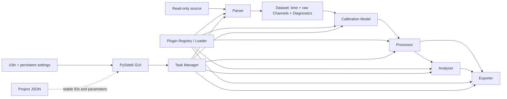

# Architecture

Underline RETLDC is an offline, layered data pipeline. Core has no GUI, TR_F, or built-in-plugin
dependency, so scientific behavior is testable without starting Qt.



## Core model

`Dataset` owns an immutable time array, a time unit, arbitrary stable-ID `Channel` objects,
metadata, and `Diagnostic` objects. A `Channel` declares quantity, unit, role, immutable values,
and metadata. Roles distinguish raw, calibrated, baseline, corrected, and processed values.

Diagnostics have `INFO`, `WARNING`, or `ERROR` severity plus a stable code, message, location,
and details. Warnings preserve usable data; errors describe conditions that prevent an operation.

## Plugin pipeline

The five Plugin API v1 contracts are Parser, Calibration Model, Processor, Analyzer, and Exporter.
Official bundled and third-party plugins use the same contracts, manifest, recursive discovery,
Registry, schema renderer, and i18n mechanism. Every concrete implementation lives below the
repository-root `plugins/` tree rather than inside the source package:

```text
Platform Core
    ↓
Plugin API v1
    ↓
plugins/
├─ parsers/
├─ calibrations/
├─ processors/
├─ analyzers/
└─ exporters/
```

The project/portable root `Underline_RETLDC/plugins/` is discovered as `Bundled`; the writable
platform user root (on Windows, `%APPDATA%/Underline_RETLDC/plugins/`) is discovered as `User`.
Both roots have the same layout and feed one `PluginRegistry`. Source provenance is assigned by
the Loader and confers no alternate API or permission. Folder categories are organizational;
manifest `plugin_type` is authoritative.

Discovery recursively finds `plugin.json`, while pruning `.venv`, `.git`, `__pycache__`, and
symlink directories. `PluginLoader` validates a manifest, API compatibility, imports, descriptor
consistency, and duplicate stable IDs while converting each failure into an isolated diagnostic.
There is no hard-coded built-in registration path. The `builtin.*` ID prefix remains stable for
official shipped plugins and does not imply a `src/underline_retldc/builtin/` implementation.

## Tasks and GUI

`TaskManager` runs parsing, processing, analysis, and export callables outside the Qt main thread.
It tracks name, progress, cancellation, success/failure, result, and exception. Algorithms receive
a framework-neutral `TaskContext`, allowing a later worker-process implementation.

The GUI currently has two primary workspaces. `Project` combines source selection, Parser probing/schema
configuration, parsing/quality diagnostics, Calibration schema configuration/JSON, and motor
metadata. `Thrust Analysis` combines test-interval candidates, numeric and draggable PRE/BURN/POST
regions, processing controls, the central pyqtgraph plot, thrust metrics, and diagnostics. Its
visible curve choices are the uncorrected and corrected signals. Workspace registration uses a
stable workspace ID so future chamber-pressure or other analyses can become distinct workspaces
without turning the current page back into a generic catch-all. The GUI invokes Core/plugins and
never contains copies of formulas.

The desktop supports stable `light` and `dark` theme IDs. Light uses white controls with dark text;
dark uses blue-grey surfaces with high-contrast light text. Navigation, application headers,
toolbars, and supported native Windows captions use coordinated deep blue. Menus, ComboBox
popups, tables, disabled controls, warnings, dialogs, status bars, and pyqtgraph plot colors are
all themed together at runtime. The selection is persisted under QSettings `ui/theme`; it is a UI
preference and never Project science state or an input to formal exporters.

Export is a menu/toolbar action opening one unified dialog. Plugin management and Settings are
modal Tools dialogs, so auxiliary operations do not fragment the main workflow. Parser and
Calibration scalar controls come from plugin schemas (`string`, `number`, `integer`, `boolean`,
and `enum`) and retain stable plugin IDs as ComboBox data.

The motor-weight compensation selector is also Registry-driven. It filters Processor plugins by
the stable `requirements()` role `motor_weight_compensation`, injects shared analysis regions via
generic schema-source metadata, and renders remaining scalar settings through `SchemaForm`.
Selecting `None` runs a Core pass-through that creates a separate processed channel without
claiming any compensation plugin provenance.

The Export dialog may be opened at every workflow stage and lists every registered Exporter whose
schema declares valid generic desktop metadata. Each choice declares the stable analyzer IDs it
depends on; its checkbox remains disabled
until those analyses are complete. When an analysis becomes complete, newly available dependent
outputs are enabled and selected by default. Export choices are held in a scrolling list that shows
at most ten rows; an eleventh choice automatically enables the vertical scrollbar. All current
outputs depend on `builtin.analyzer.thrust`. This dependency table is the extension point for future
chamber-pressure and combined-report exports.

Checkbox indicators are theme-rendered as bordered squares in unchecked, checked, and disabled
states, so no selectable or confirmable action relies on an unframed checkmark. Result tables use
stable stretch sizing; populating parser recommendations or thrust metrics never calls
content-based column shrinking.

All ComboBoxes use the shared conventional dropdown widget. A popup opens below the control when
screen space permits. Up to ten items are shown without a scrollbar; longer lists show at most ten
rows and enable vertical scrolling.

## Persistence and language

Project serialization uses `underline-retldc-project/1` and records source identity, stable plugin
IDs/versions/API generation, configurations, intervals, motor metadata, export settings, locale,
diagnostics, and explicit workflow-stage flags. All stages are nullable, so an incomplete Project
can be saved without inventing results. Raw files are referenced and hashed, not modified or
embedded. Opening validates SHA-256 before recomputation; a missing source can be relocated, but a
different hash is rejected before it enters the active session.

The unified export pipeline passes the current processed Dataset and AnalysisResult to Exporter
plugins. Untitled Projects may export directly. A saved `Test_001.retldc.json` defaults to sibling
`Test_001_exports/`; repeated exports atomically replace fixed filenames. TXT and PNG exporters
extract the final selected BURN curve, shift ignition to zero, and never reparse source data. Fixed
report names carry `_ZH` or `_EN` according to the separately selected output locale; `motor.eng`
remains unsuffixed and locale-neutral.

The translation service loads `zh_CN` and `en_US`, supports runtime switching, persists selection,
accepts plugin bundles, and falls back requested locale → `en_US` → caller default/key.

## Application entry points

The recommended development/user entry point is the repository-root `main.py`:

```powershell
python .\main.py
```

It detects whether the current interpreter belongs to the repository `.venv`. If necessary, it
relaunches itself with `.venv\Scripts\python.exe`, then adds the `src` directory to the import path.
This makes VS Code's ordinary “Run Python File” action safe without activating a shell environment.

Installed/package execution remains supported through:

```powershell
.\.venv\Scripts\python.exe -m underline_retldc
```

Direct execution of `src/underline_retldc/__main__.py` is retained for editor compatibility and
forwards to the root launcher. Business startup remains in `app/application.py`; launchers contain
environment/bootstrap logic only.
